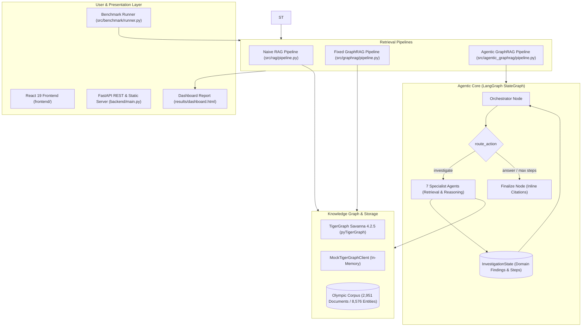

# 🐯 Agentic GraphRAG — TigerGraph Hackathon

[](https://fastapi.tiangolo.com/)
[](https://react.dev/)
[](https://tgcloud.io/)
[](https://github.com/langchain-ai/langgraph)
[]()
[]()

An autonomous, goal-driven **Agentic GraphRAG** system powered by **TigerGraph** and **LangGraph**, benchmarked side-by-side against **Naive RAG** and **Fixed-Sequence GraphRAG** across accuracy, completeness, semantic alignment (BERTScore), latency, and token efficiency. Served as a high-performance **React 19 + FastAPI** full-stack web application.

> **Headline Question:** *When does a complex query require an autonomous, multi-step investigation rather than a single vector or hardcoded graph retrieval?*

---

## 📑 Table of Contents

- [Core Highlights](#-core-highlights)
- [System Architecture](#-system-architecture)
- [The Three Compared Pipelines](#-the-three-compared-pipelines)
- [Dataset & Knowledge Graph Schema](#-dataset--knowledge-graph-schema)
- [Getting Started & Installation](#-getting-started--installation)
- [How to Run](#-how-to-run)
  - [1. React + FastAPI Full-Stack Web Application](#1-react--fastapi-full-stack-web-application)
  - [2. Automated Three-Way Benchmark Runner](#2-automated-three-way-benchmark-runner)
  - [3. TigerGraph Cloud & MCP Verification](#3-tigergraph-cloud--mcp-verification)
  - [4. Test Suite](#4-offline-smoke--unit-tests)
- [Evaluation Methodology](#-evaluation-methodology)
- [Repository Structure](#-repository-structure)
- [Submission Deliverables Checklist](#-submission-deliverables-checklist)

---

## ✨ Core Highlights

- **Dynamic LangGraph Orchestrator**: Cyclic `StateGraph` state machine that audits intermediate findings, tracks knowledge gaps, and dynamically decides its next retrieval move rather than following a static path.
- **7 Specialized Agent Nodes**:
  - *Retrieval Specialists*: Entity Linking, Graph Traversal, Vector Search, Document Retrieval.
  - *Reasoning Specialists*: Multi-Hop Decomposition, Fragment Aggregation, Evidence Sufficiency Evaluation.
- **Fair Three-Way Benchmark**: Apples-to-apples comparison isolating graph structure from agentic control flow.
- **Comprehensive Evaluation Engine**:
  - LLM-as-a-Judge scoring for factual **Accuracy** ($0.0 - 1.0$) and **Completeness** ($0.0 - 1.0$).
  - **BERTScore** semantic alignment ($F_1$, Precision, Recall) via `sentence-transformers`.
  - Token cost accounting and audit-trail metrics (step count, confidence trajectory).
- **Modern React 19 + FastAPI Web Console**: Real-time three-column execution, interactive SVG knowledge subgraphs, step-by-step LangGraph decision DAG visualizer, scorecard KPIs, and multi-model Groq selector.
- **Offline Mock & Live Cloud Modes**: Switchable between in-memory `MockTigerGraphClient` and live TigerGraph Savanna Cloud (`pyTigerGraph` + `tigergraph-mcp`).

---

## 🏛️ System Architecture



For complete state models, topological specifications, and Round 2 temporal extensions, see [`docs/architecture.md`](docs/architecture.md).

---

## 🔬 The Three Compared Pipelines

| Feature | Baseline 1: Naive RAG | Baseline 2: Fixed GraphRAG | System: Agentic GraphRAG |
| :--- | :--- | :--- | :--- |
| **Module** | [`src/rag/`](src/rag) | [`src/graphrag/`](src/graphrag) | [`src/agentic_graphrag/`](src/agentic_graphrag) |
| **Graph Structure?** | ❌ None (Flat vector only) | ✅ Yes (Entity + 1-Hop traversal) | ✅ Yes (Multi-hop $k$-hop traversals) |
| **Control Flow** | Static 1-step retrieval | Hardcoded fixed sequence: `Link → Traverse → Vector → Generate` | Dynamic, autonomous LangGraph loop with gap auditing |
| **Multi-Hop Reasoning**| ❌ Weak | ⚠️ Limited to 1-hop neighborhood | ✅ Recursive multi-step investigation |
| **Self-Auditing** | ❌ No | ❌ No | ✅ Evidence evaluation & stopping criteria |
| **Best For** | Simple single-document lookups | Direct relational facts | Complex, aggregation, superlative, & multi-hop queries |

---

## 📊 Dataset & Knowledge Graph Schema

The evaluation suite operates on the official Olympic document collection:
- **Corpus**: `2,951` Wikipedia Olympic event documents (~5.47M tokens) located in [`data/corpus/corpus.jsonl`](data/corpus/corpus.jsonl).
- **Public Evaluation**: `100` diverse questions in [`data/questions/eval_public.jsonl`](data/questions/eval_public.jsonl) covering:
  1. *Aggregation*: Counting events satisfying numeric criteria (e.g., competitors $> 73$).
  2. *Temporal Reasoning*: Traversal across preceding/succeeding Olympic Games.
  3. *Multi-Hop Traversal*: Venue $\rightarrow$ Date/Event $\rightarrow$ Gold Medalist.
  4. *Superlative Queries*: Identifying events with maximum/minimum competitors or medals.
  5. *Direct Lookup*: Single-event fact verification.
- **Hidden Evaluation**: `50` held-out benchmark questions in [`data/questions/eval_hidden.jsonl`](data/questions/eval_hidden.jsonl) for judge scoring.

### Graph Schema
- **Vertices**:
  - `Document` (`2,951` vertices): `doc_id`, `title`, `url`, `text`, `approx_tokens`.
  - `Entity` (`8,576` vertices): `name`, `entity_type` (`Event`, `Athlete`, `Venue`, `Games`, `Sport`, `Country`).
- **Edges**:
  - `MENTIONS` (`21,962` edges): `(Document) -> (Entity)`.
  - `RELATION` (`13,059` edges): `(Entity) -> (Entity)` with `rel_type` (`WON_GOLD`, `WON_SILVER`, `WON_BRONZE`, `HELD_AT`, `PART_OF_GAMES`, `IN_SPORT`).

---

## 🚀 Getting Started & Installation

### 1. Prerequisites
- Python 3.10+ (tested on Python 3.13)
- Optional: TigerGraph Savanna Cloud instance or local TigerGraph Docker container (offline mock mode works with zero installation)

### 2. Environment Setup

```bash
# Clone the repository
git clone https://github.com/t-azam747/Agentic_graphrag.git
cd Agentic_graphrag

# Create and activate virtual environment
python -m venv .venv

# Windows (PowerShell):
.\.venv\Scripts\Activate.ps1
# Linux / macOS:
source .venv/bin/activate

# Install dependencies
pip install -r requirements.txt
```

### 3. Environment Variables Configuration

Copy `.env.example` to `.env`:
```bash
cp .env.example .env
```

Configure your credentials in `.env`:
```env
# --- LLM Provider ---
LLM_PROVIDER=groq                     # "groq" | "anthropic" | "openai"
GROQ_API_KEY=your_groq_api_key
GROQ_MODEL=openai/gpt-oss-120b        # or qwen/qwen3.8-27b
# ANTHROPIC_API_KEY=your_claude_key
# OPENAI_API_KEY=your_openai_key

# --- TigerGraph Configuration ---
TG_USE_MOCK=false                     # set true for offline development, false for live Savanna
TG_HOST=https://your-instance.i.tgcloud.io
TG_GRAPHNAME=AgenticGraphRag
TG_SECRET=your_gsql_secret
TG_TGCLOUD=true
```

---

## 💻 How to Run

### 1. React + FastAPI Full-Stack Web Application

The project features a cutting-edge **React 19 + FastAPI** architecture with interactive SVG knowledge subgraphs, LangGraph decision trail DAGs, real-time scorecard KPIs, and multi-model Groq LLM selection:

#### Option A: All-in-One Production Server (Recommended)
Run the FastAPI server which serves both the REST API and the compiled React production frontend on port `8000`:

```powershell
python run_backend.py
```
*Open **`http://localhost:8000`** in your browser.*

#### Option B: Developer Mode with Hot-Reloading
Run backend and frontend independently for live hot-reloading:

```powershell
# Terminal 1 — FastAPI Backend (Port 8000)
python run_backend.py

# Terminal 2 — React Vite Frontend (Port 5173 with auto /api proxy)
npm --prefix frontend run dev
```
*Open **`http://localhost:5173`** in your browser.*

---

### 2. Automated Three-Way Benchmark Runner

Execute all three pipelines across questions, compute LLM-as-a-judge accuracy and BERTScore, and save raw audit runs:

```powershell
python -m src.benchmark.runner
```
Outputs are saved to [`results/benchmark_results.json`](results/benchmark_results.json) and [`results/raw_runs.json`](results/raw_runs.json).

### 3. TigerGraph Cloud & MCP Verification

Test your live connection to TigerGraph Savanna Cloud and the TigerGraph Model Context Protocol (MCP) server:

```powershell
python test_connection.py
```

### 4. Offline Smoke & Unit Tests

Run the offline pytest test suite (12 passing tests):

```powershell
python -m pytest
```


---

## 📐 Evaluation Methodology

For every test question across all three pipelines, the system logs and calculates:

1. **Investigation Accuracy ($0.0 - 1.0$)**: LLM-as-a-Judge semantic verification against held-out ground truth.
2. **Completeness ($0.0 - 1.0$)**: Verification that all constraints and entities of the query are resolved.
3. **BERTScore ($F_1$, Precision, Recall)**: Dense embedding token alignment using `sentence-transformers/all-MiniLM-L6-v2`.
4. **Token Efficiency**: Exact input, output, and total tokens tracked per step.
5. **Traceability & Explainability**:
   - Total retrieval and reasoning hops.
   - Dynamic strategy changes during execution.
   - Inline evidence citations (e.g., `[e1]`, `[d2]`).
   - Termination cause (`answered` vs `max_steps_reached`).

---

## 📁 Repository Structure

```
agentic_graphrag/
├── backend/                       # FastAPI REST API & static file server
│   └── main.py                    # REST endpoints, background benchmarks & SSE
├── frontend/                      # Modern React 19 + Vite 8 frontend
│   ├── src/                       # Components (Navbar, Tabs, Visualizers)
│   ├── package.json
│   └── dist/                      # Pre-compiled production bundle
├── run_backend.py                 # Unified server launcher (Port 8000)
├── scripts/
│   ├── ingest_corpus.py           # TigerGraph schema creation & data loader
│   └── test_tgcloud.py            # Savanna connection & token tester
├── src/
│   ├── shared/                    # Shared infrastructure (imported by all pipelines)
│   │   ├── config.py              # Central configuration from .env
│   │   ├── state.py               # InvestigationState, EvidenceItem, InvestigationStep
│   │   ├── llm.py                 # Choke-point LLM gateway (Groq, Anthropic, OpenAI, Mock)
│   │   ├── embeddings.py          # Dense vector embedder with deterministic fallback
│   │   └── tigergraph_client.py   # Real pyTigerGraph & MockTigerGraphClient
│   ├── rag/                       # Baseline 1: Naive vector search
│   │   └── pipeline.py            # Flat vector search -> LLM synthesis
│   ├── graphrag/                  # Baseline 2: Fixed GraphRAG
│   │   └── pipeline.py            # Entity Link -> 1-Hop Traverse -> Vector -> LLM synthesis
│   ├── agentic_graphrag/          # System: Autonomous Agentic GraphRAG
│   │   ├── pipeline.py            # Pipeline entry point
│   │   └── agents/
│   │       ├── orchestrator.py    # LangGraph StateGraph cyclic control loop
│   │       ├── retrieval.py       # Entity link, graph traverse, vector search, doc retrieve
│   │       └── reasoning.py       # Aggregation, multi-hop reasoning, evidence evaluation
│   └── benchmark/                 # Scoring and evaluation suite
│       ├── runner.py              # Batch runner over JSON/JSONL datasets
│       ├── metrics.py             # LLM-as-a-judge scoring
│       ├── bert_scorer.py         # BERTScore semantic evaluator
│       ├── dashboard.py           # Standalone HTML/Chart.js report generator
│       └── visualizer.py          # Plotly network graphs & DAG visualizers
└── tests/                         # Pytest test harness
```

---

## 📋 Submission Deliverables Checklist

| Hackathon Requirement | Repository File / Component | Status |
| :--- | :--- | :--- |
| **Working Agentic GraphRAG System** | [`src/agentic_graphrag/agents/orchestrator.py`](src/agentic_graphrag/agents/orchestrator.py) | ✅ Operational |
| **Three-Way Benchmark** | [`src/benchmark/runner.py`](src/benchmark/runner.py) | ✅ Operational |
| **Metrics Dashboard** | [`src/benchmark/dashboard.py`](src/benchmark/dashboard.py) → `results/dashboard.html` | ✅ Operational |
| **Interactive UI Demo** | [`frontend/`](frontend/) (React 19 SPA) & [`backend/`](backend/) (FastAPI REST API) | ✅ Operational |
| **Architecture Specification** | [`docs/architecture.md`](docs/architecture.md) | ✅ Complete |
| **TigerGraph Ingestion Pipeline** | [`scripts/ingest_corpus.py`](scripts/ingest_corpus.py) | ✅ Complete |
| **Offline Test Suite** | [`tests/test_harness.py`](tests/test_harness.py) + [`tests/test_bert_score.py`](tests/test_bert_score.py) | ✅ 12/12 Passing |
| **GitHub Repository** | [`t-azam747/Agentic_graphrag`](https://github.com/t-azam747/Agentic_graphrag.git) | ✅ Active |

---

## 📄 License

This project is licensed under the MIT License. See [LICENSE](LICENSE) for details.
