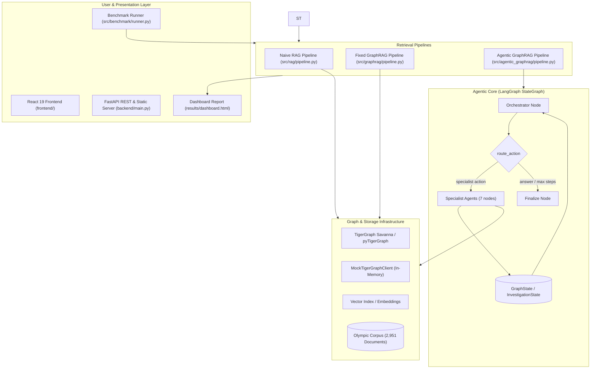
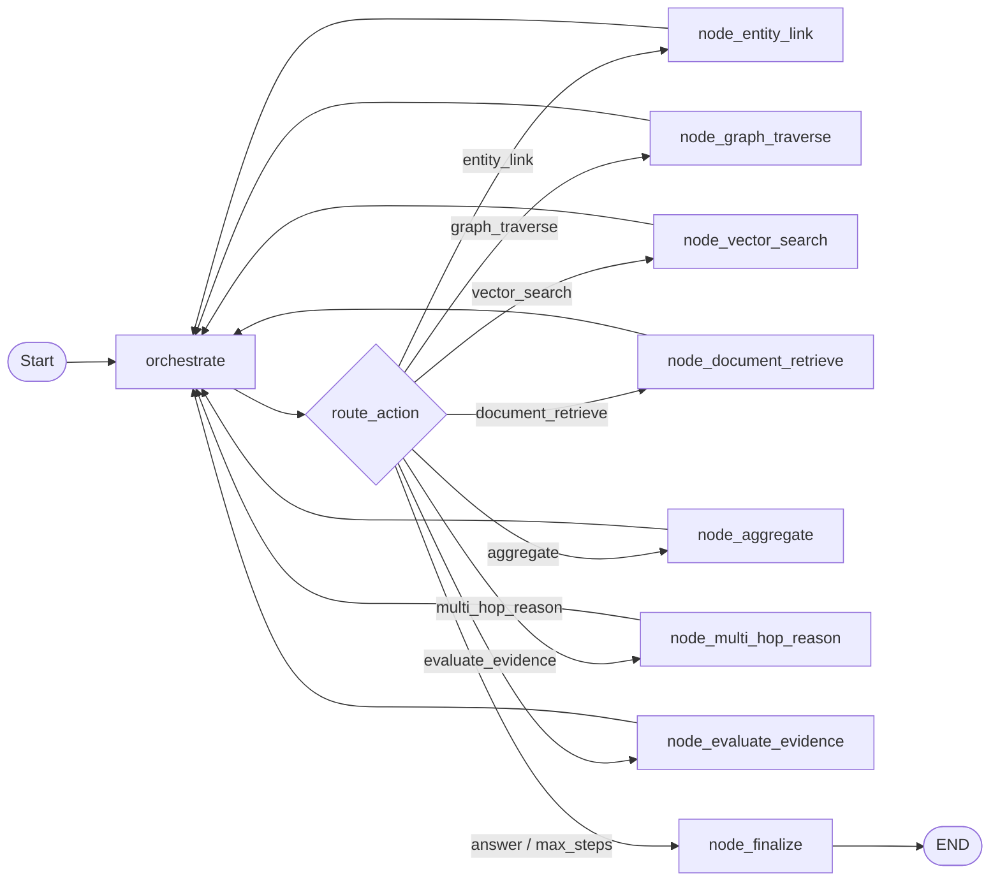
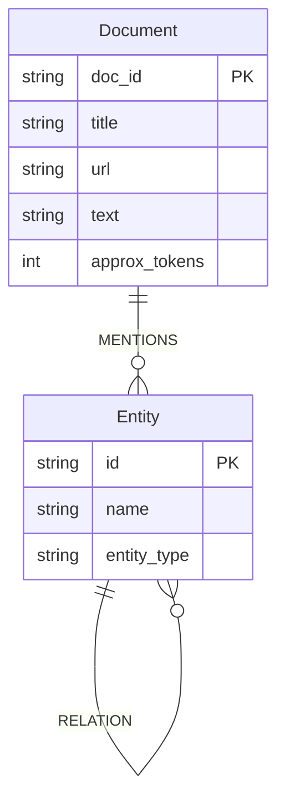
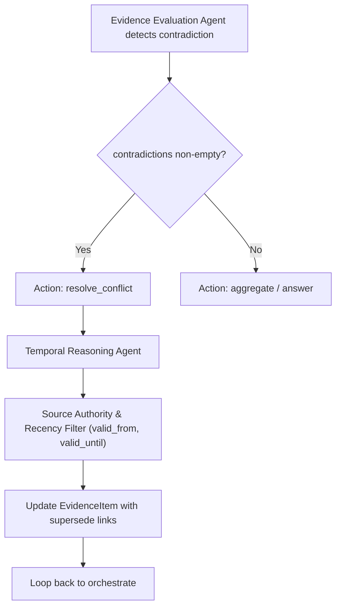

# 🐯 Agentic GraphRAG Architecture Specification

> **System Architecture, Control Flow, and Technical Design Document**  
> *TigerGraph Agentic GraphRAG Hackathon — Round 1 & Round 2*

---

## 1. Executive Summary & Problem Formulation

Standard Retrieval-Augmented Generation (**RAG**) relies on flat vector similarity searches over text chunks. While effective for simple single-fact lookups, it fails on complex questions requiring relational context, multi-hop reasoning, aggregation, or temporal tracking.

**GraphRAG** addresses this by incorporating structured graph knowledge (entities and relationships). However, conventional GraphRAG systems follow a **rigid, hardcoded retrieval sequence** (e.g., always: *Entity Link $\rightarrow$ 1-Hop Traverse $\rightarrow$ Vector Search $\rightarrow$ Generate*). This leads to:
- Over-retrieval and wasted token budgets on simple queries.
- Under-retrieval and failed reasoning on multi-hop or aggregation queries requiring exploratory or branching investigations.

**Agentic GraphRAG** introduces an **autonomous, goal-driven control loop** implemented via **LangGraph**. The system inspects intermediate evidence, audits remaining knowledge gaps, and dynamically decides its next retrieval or reasoning move.

```
                              ┌──────────────┐
                              │ User Query   │
                              └──────┬───────┘
                                     │
             ┌───────────────────────┼───────────────────────┐
             ▼                       ▼                       ▼
    ┌─────────────────┐    ┌──────────────────┐    ┌──────────────────┐
    │    Naive RAG    │    │  Fixed GraphRAG  │    │ Agentic GraphRAG │
    │ (Flat Vector)   │    │ (Fixed Sequence) │    │ (Dynamic Loop)   │
    └────────┬────────┘    └────────┬─────────┘    └────────┬─────────┘
             ▼                       ▼                       ▼
    Single-hop facts        Structured 1-hop facts  Multi-hop, aggregated,
                                                    audited evidence
             │                       │                       │
             └───────────────────────┼───────────────────────┘
                                     ▼
                      ┌─────────────────────────────┐
                      │  Comparative Benchmark      │
                      │  - Accuracy & Completeness  │
                      │  - Token Efficiency         │
                      │  - Latency & Audit Trace    │
                      └─────────────────────────────┘
```

---

## 2. High-Level System Architecture

The overall repository is modularized into distinct layers with strict dependency boundaries:
- [`src/shared/`](../src/shared): Common abstractions ([`Config`](../src/shared/config.py#L10), [`InvestigationState`](../src/shared/state.py#L52), [`TigerGraphClient`](../src/shared/tigergraph_client.py#L17), [`LLM`](../src/shared/llm.py), [`Embeddings`](../src/shared/embeddings.py)).
- [`src/rag/`](../src/rag): Baseline 1 (vector search only).
- [`src/graphrag/`](../src/graphrag): Baseline 2 (fixed-sequence graph + vector).
- [`src/agentic_graphrag/`](../src/agentic_graphrag): System under test (LangGraph orchestrator + 7 specialist agents).
- [`src/benchmark/`](../src/benchmark): LLM-as-a-Judge scoring, metric aggregations, HTML dashboard.
- [`backend/`](../backend): High-performance FastAPI REST API serving all pipelines, cluster status, and benchmark execution.
- [`frontend/`](../frontend): Modern React 19 + Vite 8 Single Page Application with interactive SVG subgraphs and LangGraph decision DAGs.
- [`run_backend.py`](../run_backend.py): Unified server launcher hosting the FastAPI REST API and static React UI.



---

## 3. The Agentic Control Loop (LangGraph StateGraph)

The agentic pipeline is built on **LangGraph** ([`src/agentic_graphrag/agents/orchestrator.py`](../src/agentic_graphrag/agents/orchestrator.py)) using a cyclic state machine.

### 3.1 State Representation

The agent operates over two interconnected state models:

1. **[`InvestigationState`](../src/shared/state.py#L52)**: Domain model holding accumulated findings:
   - `evidence: dict[str, EvidenceItem]`: Deduplicated evidence items tagged with provenance, confidence, and conflict flags.
   - `steps: list[InvestigationStep]`: Audit log of decisions, rationale, tools invoked, and token expenditures.
   - `linked_entities: list[dict]`: Cache of entities resolved in graph searches.
   - `gaps: list[str]`: Running notes on missing links or unverified facts.
   - `final_answer: str` and `final_confidence: float`.

2. **[`GraphState`](../src/agentic_graphrag/agents/orchestrator.py#L43)**: LangGraph `TypedDict` wrapper passed between nodes:
   ```python
   class GraphState(TypedDict):
       inv: InvestigationState    # Domain state
       client: Any                # TigerGraphClient instance
       next_action: str           # Action decided by orchestrator
       next_input: dict           # Input arguments for specialist node
       rationale: str             # Reasoning behind action selection
   ```

### 3.2 State Machine Topology



### 3.3 Dynamic Routing & Stopping Criteria

At each turn of [`orchestrate`](../src/agentic_graphrag/agents/orchestrator.py#L99):
1. **Budget Check**: If `inv.should_force_stop(CONFIG.max_investigation_steps)` is true, execution routes directly to `finalize` with reason `max_steps_reached`.
2. **Context Assembly**: The prompt provides the user query, previously taken actions, the latest gap note, and condensed evidence summary (`max_chars=4000`).
3. **Structured Decision**: The LLM outputs strict JSON selecting an action, input arguments, and rationale.
4. **Conditional Branching ([`route_action`](../src/agentic_graphrag/agents/orchestrator.py#L126))**: The router dispatches to the requested specialist node, which updates the evidence store and loops back to `orchestrate`.
5. **Terminal Finalization ([`node_finalize`](../src/agentic_graphrag/agents/orchestrator.py#L203))**: Synthesizes the final response citing evidence IDs inline (e.g., `[e1]`, `[d1]`), computes total token expenditure, and sets `stopped=True`.

---

## 4. Specialist Agent Specifications

The orchestrator coordinates seven specialized agents separated into **Retrieval Specialists** (stateless I/O with graph & docs) and **Reasoning Specialists** (LLM analysis of accumulated state):

| Agent Name | Category | Function Signature | Description |
| :--- | :--- | :--- | :--- |
| **`entity_linking_agent`** | Retrieval | `(state, client, mention: str)` | Queries TigerGraph for candidate vertices matching a name or term. Records [`EvidenceItem`](../src/shared/state.py#L28) with `confidence=0.9`. |
| **`graph_traversal_agent`** | Retrieval | `(state, client, start_node_id: str, hops: int, edge_types: list)` | Performs $k$-hop graph walks from a known vertex. Returns structured relations (`src --rel--> dst`). |
| **`vector_search_agent`** | Retrieval | `(state, client, query_text: str, top_k: int)` | Computes query vector embedding and retrieves top-ranked unstructured text passages. |
| **`document_retrieval_agent`**| Retrieval | `(state, client, doc_id: str)` | Fetches the full text of an article when an evidence snippet references a specific document ID. |
| **`aggregation_agent`** | Reasoning | `(state)` | Synthesizes multiple evidence fragments into a unified summary and flags potential contradictions. |
| **`multi_hop_reasoning_agent`**| Reasoning | `(state, sub_question: str)` | Decomposes complex logic into explicit chains, tracking exact evidence IDs used for each hop and noting missing links. |
| **`evidence_evaluation_agent`**| Reasoning | `(state)` | Audits evidence sufficiency against the query, outputs confidence $[0, 1]$, and identifies remaining gaps. |

---

## 5. TigerGraph Schema & Knowledge Graph Design

The knowledge graph is modeled to represent the Olympic corpus ([`data/corpus/corpus.jsonl`](../data/corpus/corpus.jsonl)), containing 2,951 documents and ~5.47M tokens.

### 5.1 Graph Schema Topology



- **Vertex Types**:
  - `Document`: Stores full text, Wikipedia URL, title, and token count.
  - `Entity`: Normalized entities across 6 domain types:
    - `Event` (e.g., `Event:Q1050909`)
    - `Athlete` (e.g., `Athlete:Chen Ding`, `Athlete:Renaud Lavillenie`)
    - `Venue` (e.g., `Venue:Olympic Stadium`, `Venue:Eton Dorney`)
    - `Games` (e.g., `Games:2012 Summer Olympics`, `Games:2018 Winter Olympics`)
    - `Sport` (e.g., `Sport:Athletics`, `Sport:Biathlon`, `Sport:Canoeing`)
    - `Country` (e.g., `Country:CHN`, `Country:FRA`, `Country:USA`)

- **Edge Types**:
  - `MENTIONS`: `(Document) -> (Entity)`: Documents linking to referenced entities.
  - `RELATION`: `(Entity) -> (Entity)`: Typed graph relations with `rel_type` attribute:
    - `WON_GOLD`, `WON_SILVER`, `WON_BRONZE`: `(Athlete) -> (Event)`
    - `HELD_AT`: `(Event) -> (Venue)`
    - `PART_OF_GAMES`: `(Event) -> (Games)`
    - `IN_SPORT`: `(Event) -> (Sport)`

### 5.2 Ingestion Engine ([`scripts/ingest_corpus.py`](../scripts/ingest_corpus.py))

1. Streams `corpus.jsonl` line by line.
2. Extracts structured Olympic Infobox attributes (`games`, `venue`, `gold`, `silver`, `bronze`, `goldNOC`, etc.) via regex parsers.
3. Batches vertex and edge upserts (default batch size: 150) using `conn.upsertVertices` and `conn.upsertEdges`.
4. Supports live ingestion into TigerGraph Savanna Cloud or local Docker instances.

---

## 6. Three-Way Comparative Methodology

To objectively evaluate the contribution of **agentic orchestration**, the benchmark isolates graph structure from control flow:

```
+-------------------+--------------------+---------------------------------------------+
| Pipeline          | Graph Structure?   | Control Flow Mechanism                      |
+-------------------+--------------------+---------------------------------------------+
| Naive RAG         | No                 | Single vector search -> LLM generation      |
| Fixed GraphRAG    | Yes                | Hardcoded: Link -> 1-Hop -> Vector -> Gen   |
| Agentic GraphRAG  | Yes                | Dynamic: LangGraph loop guided by evidence  |
+-------------------+--------------------+---------------------------------------------+
```

- **Why Fixed GraphRAG is essential**: If Agentic GraphRAG was only compared against Naive RAG, any performance gain could be attributed solely to the presence of graph edges. Comparing against a fixed-sequence GraphRAG isolates the value of **autonomous multi-step reasoning**.

---

## 7. Evaluation & Benchmark Metrics

Scoring is executed by [`src/benchmark/runner.py`](../src/benchmark/runner.py) and evaluated in [`src/benchmark/metrics.py`](../src/benchmark/metrics.py):

### 7.1 Accuracy & Completeness (LLM-as-a-Judge)

Each candidate answer is evaluated against the gold answer using a strict judge prompt:
- **Accuracy ($0.0 - 1.0$)**: Verifies factual correctness and penalizes hallucinations or contradictions.
- **Completeness ($0.0 - 1.0$)**: Assesses whether all sub-components of the query are resolved.
- **Justification**: Records the judge's qualitative rationale for transparency.

### 7.2 Token Efficiency

Measures the cost-to-performance trade-off:
$$\text{Token Efficiency} = \frac{\text{Baseline Tokens}}{\text{Candidate Tokens}}$$
- A ratio of $1.0$ indicates parity with naive RAG.
- Ratios $< 1.0$ quantify the additional token investment required for multi-step reasoning, contextualized against the resulting accuracy gains.

### 7.3 Trace Auditability & Agent Metrics

For the agentic pipeline, the system logs:
- Total steps taken and termination trigger (`answered`, `max_steps_reached`).
- Specialist agents invoked per turn.
- Intermediate confidence trajectory ($0.0 \rightarrow 1.0$).
- Inline citation density and evidence source references.

---

## 8. User Interface & Interactive Demo

The React 19 + FastAPI web application ([`frontend/`](../frontend), [`backend/main.py`](../backend/main.py)) provides:
1. **Interactive Investigation Console**: Pre-loaded with challenge questions across aggregation, temporal, multi-hop, and superlative categories.
2. **Three-Panel Comparative Execution**: Real-time display of answers, latencies, token counts, and live BERTScore metrics across Naive RAG, Fixed GraphRAG, and Agentic GraphRAG.
3. **Interactive Knowledge Subgraph Visualizer**: Vector-rendered SVG network displaying retrieved Olympic entities, venues, sports, and countries with zoom, pan, and node inspection.
4. **Step-by-Step LangGraph Decision Trail DAG**: Visual execution trail displaying each orchestrator decision, tool invocation, token consumption, and evidence fragment.
5. **Autonomous Diagnostics Modal**: One-click verification suite testing TigerGraph Savanna connectivity, LLM API keys, and BERTScore embedding pipelines.
6. **Benchmark Scorecard & Export Engine**: Direct execution of the held-out benchmark with live progress bar and CSV/JSON export.

---

## 9. Round 2 Roadmap: Temporal & Conflicting Reasoning

For Round 2 (handling evolving, conflicting, and uncertain facts), the architecture is designed with forward-compatible extension hooks:



1. **State Extension**:
   - Add `valid_from: Optional[str]`, `valid_until: Optional[str]`, and `source_authority: float` to [`EvidenceItem`](../src/shared/state.py#L28).
2. **New Specialist Node**:
   - Implement `temporal_reasoning_agent` to compare conflicting facts based on timestamp ordering, Wikipedia revision dates, or domain authority.
3. **Orchestrator Routing**:
   - Add `resolve_conflict` to [`ActionType`](../src/shared/state.py#L16). When [`evidence_evaluation_agent`](../src/agentic_graphrag/agents/reasoning.py#L58) flags non-empty contradictions, the orchestrator triggers conflict resolution rather than prematurely falling back to `answer`.
