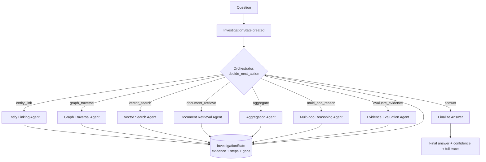
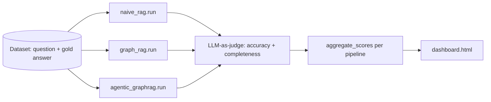

# Architecture

## Control flow (the agentic pipeline)

Each specialized agent writes `EvidenceItem`s into the shared `InvestigationState`;
the orchestrator reads that same state to pick the next action. There is no
hardcoded sequence — `evaluate_evidence`'s reported gap is what steers the
next 1-2 decisions, and `graph_traverse` can't run before `entity_link` has
produced a `start_node_id`, but beyond that ordering constraint the loop is
fully data-driven.

## Benchmark comparison

## Why three pipelines, not one

| Pipeline | Graph structure? | Control flow | Purpose |
|---|---|---|---|
| `naive_rag` | No | Single vector search → generate | Floor baseline |
| `graph_rag` | Yes | Fixed sequence: entity link → 1-hop traverse → vector search → generate | Isolates the value of graph structure alone |
| `agentic_graphrag` | Yes | Orchestrator loop, action chosen per step from evidence state | The system under test |

Fixing `graph_rag`'s sequence (rather than making it agentic too) is
deliberate — it's the only way the benchmark can attribute score deltas
specifically to *agentic control*, separate from the value of graph
structure itself.

## Extending to Round 2 (temporal / conflicting facts)

`EvidenceItem` already carries a `contradicts: list[str]` field and
`evidence_evaluation_agent` already returns a `contradictions` list — Round 2
work plugs into these:

1. Add a `valid_from` / `valid_until` (or `as_of`) field to `EvidenceItem`.
2. Add a `temporal_reasoning_agent` that, given two evidence items pointing at
   the same fact-slot, decides which supersedes which (recency, source
   authority, explicit revision links in the graph).
3. Add a new orchestrator action `resolve_conflict` that's proposed by
   `evaluate_evidence` whenever it populates `contradictions` non-empty,
   instead of falling straight to `answer`.
